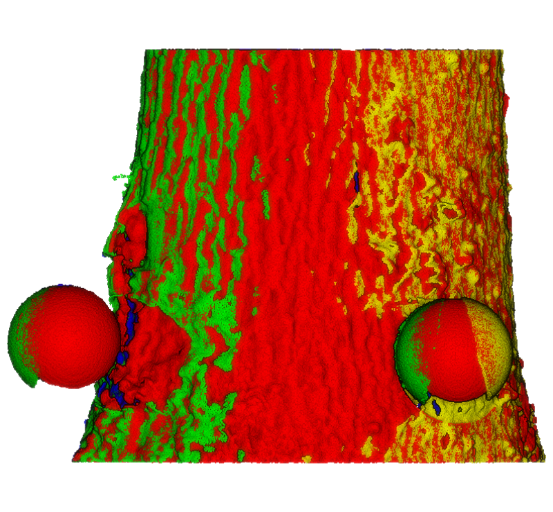
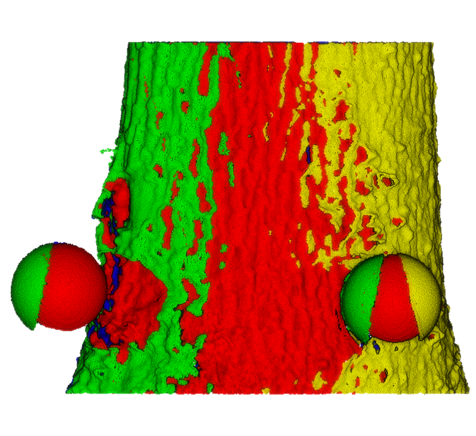

# SCAN OVERLAP MANAGEMENT 

<div style="display: flex; justify-content: space-around;">
  
  
</div>

This GitHub contains code for pre-processing tree scans in an outdoor acquisition context. It often happens during scanning that several scans overlap. We propose handling this case with a fast and simple algorithm that takes into account the cylindrical shape of the tree and its curvature. The data is provided on this GitHub, which explains the slightly long download time. There are 3 input files for this program.

- **\*_Cloud.xyz** : The raw file of the tree scan. It contains the different scans in the same reference frame.
- **\*_centerline.xyz** : The file of the central line of the trunk in the form of points.
- **\*_clean.id** : The file that contains the points to be processed by the algorithm for managing overlapping areas.

## dependencies

DGtal version 1.4 or later, see [DGtal installation] (https://github.com/DGtal-team/DGtal).

## compilation instructions

```
mkdir build
cd build
cmake ..  -DDGtal_DIR=/path/to/DGtal
make
```

## example of use

You can use the code on a sample provided in the data directory. For example, for the WSPS4 sample, the command to type in a terminal is : 
```
./logRec -i ../data/RGB_R_WSPS4_Cloud.xyz -c ../data/WSPS4_centerline.xyz -p ../data/WSPS4_clean.id  -o test
```
This command generates two files: test_rec.id and test_rec_colorByScan.xyz

- **test_rec.id** : Contains the identifiers of the points after applying the scan overlap management algorithm. 
- **test_rec_colorByScan.xyz** : Contains the resulting point cloud with a color associated with each scan.